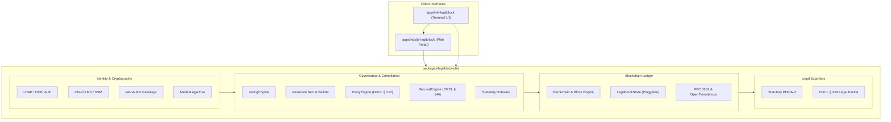

# LegitBlock Monorepo

[](https://github.com/Legitblock/legitblock/actions/workflows/ci.yml)
[](https://nodejs.org/)
[](https://pnpm.io/)
[](https://nextjs.org/)
[](https://github.com/vadimdemedes/ink)
[](https://opensource.org/licenses/MIT)

> **LegitBlock** is an enterprise-grade statutory organizational blockchain, governance state machine, and legal-tech framework. It provides cryptographically enforceable corporate minutes, bylaws, resolutions, and shareholder voting systems compliant with state and international corporate codes.

---

## 🏛️ Monorepo Overview

This repository is structured as a pnpm workspace containing the core cryptographic utility engine, a full-stack governance web portal, and an interactive terminal CLI:

```
legitblock/
├── packages/
│   └── legitblock-utils/       # @legitblock/legitblock-utils: Core SDK & Cryptographic Library
└── apps/
    ├── nextjs-legitblock/      # Next.js 14 corporate governance & ledger management portal
    └── ink-legitblock/         # Interactive Terminal UI (TUI) client built with React Ink
```

| Workspace Package | Type | Description |
|:---|:---|:---|
| [`@legitblock/legitblock-utils`](packages/legitblock-utils) | Library | Core blockchain data structures, cryptographic primitives, Merkle legal trees, verifiable secret ballots, statutory rule engines, storage adapters, and legal packet exporters. |
| [`nextjs-legitblock`](apps/nextjs-legitblock) | Full-Stack App | Next.js 14 App Router portal with REST APIs, Server-Sent Events (SSE) ledger stream, proposal lifecycles, and audit viewer. |
| [`ink-legitblock`](apps/ink-legitblock) | Terminal App | Interactive command-line interface for drafting amendments in `$EDITOR`, casting ballots, reviewing diffs, and inspecting chain status. |

---

## ⚡ Core Capabilities & Subsystems

### 1. 🗳️ Advanced Governance & Voting Engines
- **Verifiable Secret Ballots**: Zero-knowledge ballot casting using homomorphic Pedersen commitments ($C = g^v \cdot h^r \pmod p$), ensuring information-theoretic hiding of individual votes while enabling publicly verifiable aggregate tallies.
- **Delegated Proxy Voting (DGCL § 212)**: Authorizes proxy grants with cryptographic signature verification, circular-delegation cycle detection, subject-matter scope restrictions, and instant revocation.
- **Conflict-of-Interest & Recusal Engine (DGCL § 144)**: Enforces statutory recusal for interested directors, dynamically recalculates disinterested quorums, and generates non-repudiable compliance receipts.
- **Biometric Passkey Ballots (WebAuthn / FIDO2)**: Hardware-backed voting assertions via TouchID, FaceID, or physical security keys.
- **Enterprise HSM & Cloud KMS**: Integration adapters for hardware-enclave signing across AWS KMS, Google Cloud KMS, and Azure Key Vault.

### 2. 📜 Statutory Document Management & Legal Packet Exporters
- **Section-Level Merkle Legal Trees**: Deconstructs organizational charters and bylaws into granular clause-level Merkle leaves, generating cryptographic inclusion proofs (`auditPath`) and immediate tamper detection.
- **Statutory PDF/A-3 Exporter**: Generates ISO 19005-3 compliant legal packets embedding machine-readable JSON metadata, cryptographic block hashes, and statutory recitals entirely in JavaScript.
- **DGCL § 224 Legal Packet Exporter**: Produces court-admissible board and shareholder minute books in Markdown and JSON formats, with historical time-travel state reconstruction.
- **Structured Redline Diffing**: Character- and line-level semantic diffing between document revisions with formatted terminal and visual displays.

### 3. ⛓️ Blockchain Ledger & Public Anchoring
- **Deterministic State Machine**: SHA-256 block hashing, proof-of-authority / consortium validator consensus, and tamper-evident transaction chaining.
- **Public Checkpoint Anchoring**: Anchors internal blockchain block headers to public trust systems using OpenTimestamps (Bitcoin calendar servers) and RFC 3161 cryptographic Timestamp Authorities (TSA).

### 4. 🏢 Enterprise Authentication & Storage
- **Identity Providers**: LDAP / Active Directory directory authentication, OpenID Connect (OIDC) JWT claims-to-governance role mapping, and role-based access control.
- **Pluggable Storage Layer**: Modular persistence abstraction supporting in-memory storage, filesystem persistence (`JSON`), and browser `IndexedDB`.

### 5. ⚖️ Multi-Jurisdictional Statutory Rulesets
- **Delaware C-Corp**: 8 Del. C. § 216 quorum rules, § 224 electronic records, § 144 recusal, and § 212 proxies.
- **California Worker Cooperative**: California AB 816 equal vote mandate (*one-worker-one-vote*).
- **Wyoming DUNA**: W.S. § 17-31 statutory non-profit asset lock and algorithmic governance.
- **United Kingdom**: UK Companies Act 2006 s. 283 Special Resolution 75% majority threshold.

---

## 🏗️ Architecture & Data Flow



---

## 🚀 Quick Start & Development

### Prerequisites
- **Node.js**: `v20.x` or `v22.x` (LTS)
- **pnpm**: `v12.x` or `v9.x` (`corepack enable && corepack prepare pnpm@latest --activate`)

### Installation
Clone the repository and install all workspace dependencies:
```bash
git clone git@github.com:Legitblock/legitblock.git
cd legitblock
pnpm install
```

### Running Test Suites
Execute all 15 comprehensive unit and organizational workflow test suites:
```bash
pnpm test
```

Or run targeted test suites:
```bash
# Test specific subsystems
pnpm --filter @legitblock/legitblock-utils test:storage       # Storage adapters
pnpm --filter @legitblock/legitblock-utils test:merkle        # Merkle legal trees & inclusion proofs
pnpm --filter @legitblock/legitblock-utils test:secret-ballot # Pedersen commitments & secret voting
pnpm --filter @legitblock/legitblock-utils test:proxy         # Delegated proxy voting (DGCL § 212)
pnpm --filter @legitblock/legitblock-utils test:recusal       # Conflict of interest & recusal (DGCL § 144)
pnpm --filter @legitblock/legitblock-utils test:jurisdictions # Delaware, CA Co-op, Wyoming, UK statutes
pnpm --filter @legitblock/legitblock-utils test:pdf           # ISO 19005-3 statutory PDF/A-3 export
pnpm --filter @legitblock/legitblock-utils test:anchoring     # OpenTimestamps & RFC 3161 TSA
pnpm --filter @legitblock/legitblock-utils test:kms           # Hardware Security Module & Cloud KMS
pnpm --filter @legitblock/legitblock-utils test:webauthn      # WebAuthn passkey biometric signing
pnpm --filter @legitblock/legitblock-utils test:covenants     # Smart legal covenants
pnpm --filter @legitblock/legitblock-utils test:oidc          # Enterprise OIDC federation
pnpm --filter @legitblock/legitblock-utils test:exporter      # DGCL § 224 legal packet exporter
pnpm --filter @legitblock/legitblock-utils test:workflows     # End-to-end organizational workflows
```

---

## 📱 Running the Applications

### Next.js Governance Portal (`apps/nextjs-legitblock`)
Start the web development server:
```bash
pnpm --filter nextjs-legitblock dev
```
Open [http://localhost:3000](http://localhost:3000) to access the corporate governance dashboard, browse documents, inspect real-time SSE block streams, and review active shareholder proposals.

To build the Next.js application for production:
```bash
pnpm --filter nextjs-legitblock build
```

### Interactive Ink Terminal CLI (`apps/ink-legitblock`)
Run the interactive terminal client:
```bash
node apps/ink-legitblock/src/cli.js
```
The terminal client allows you to:
- Authenticate via LDAP credentials.
- Inspect corporate documents and edit them using your preferred system editor (`$EDITOR` / nano / vim).
- Create amendments and submit them as formal proposals.
- Cast democratic votes on active ballots.
- Execute approved proposals and seal new blocks onto the ledger.

---

## 📚 Detailed Documentation

- 🏛️ [Monorepo Architecture Guide](docs/ARCHITECTURE.md)
- 🧩 [Core Library Module Reference](docs/MODULES.md)
- 🗳️ [Corporate Governance & Voting Guide](docs/GOVERNANCE.md)
- 💻 [Ink Terminal CLI User Guide](docs/CLI_GUIDE.md)
- 🤝 [Contributing Guidelines](docs/CONTRIBUTING.md)

---

## 📄 License

This repository is licensed under the [MIT License](LICENSE).
