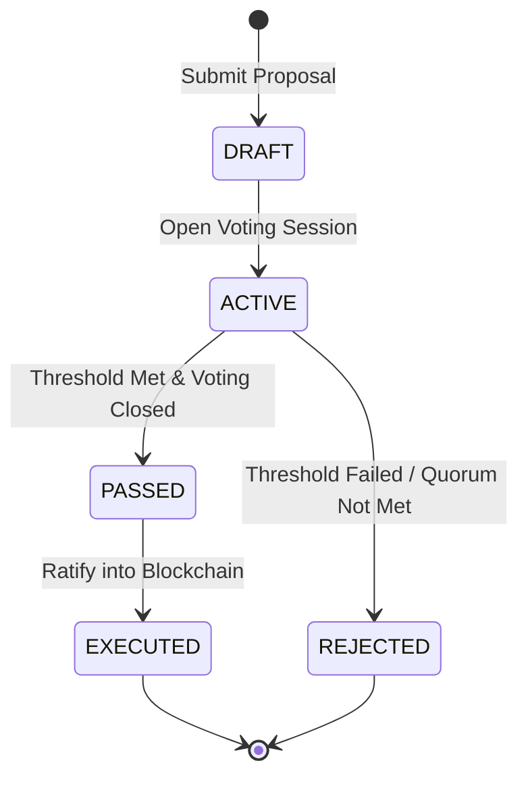

# Corporate Governance & Voting Engine

LegitBlock provides a mathematically rigorous, statutory-compliant governance framework for corporations, cooperatives, non-profits, and decentralized organizations.

---

## 1. Proposal Lifecycle State Machine

Every corporate resolution or document modification follows an immutable state machine:

### Lifecycle States
1. **`DRAFT`**: Proposal is formulated with title, description, target document/action, and proposed changes.
2. **`ACTIVE`**: Voting window is open. Members cast cryptographically signed ballots.
3. **`PASSED`**: The voting period ends or early ratification occurs with required quorum and approval percentages satisfied.
4. **`REJECTED`**: Proposal fails to reach quorum or fails the required affirmative threshold.
5. **`EXECUTED`**: Changes are applied to organizational documents, and an execution transaction is sealed into a new block on the ledger.

---

## 2. Statutory Voting Rules

LegitBlock supports parameterized voting rules adapted to statutory requirements:

| Voting Rule | Quorum Required | Approval Required | Statutory Context |
|:---|:---|:---|:---|
| **Simple Majority** | $\ge 50\%$ | $> 50\%$ of votes cast | Standard corporate resolutions (DGCL § 216) |
| **Absolute Majority** | $\ge 50\%$ | $> 50\%$ of all eligible voting power | Fundamental corporate transactions |
| **Supermajority (Two-Thirds)** | $\ge 60\%$ | $\ge 66.67\%$ | Bylaw amendments, mergers, dissolutions |
| **Supermajority (Three-Fourths)** | $\ge 66.7\%$ | $\ge 75.0\%$ | UK Companies Act 2006 s. 283 Special Resolutions |
| **Unanimous Consent** | $100\%$ | $100\%$ | Board action by unanimous written consent (DGCL § 141(f)) |
| **Worker Co-op Equal Vote** | $\ge 50\%$ | $> 50\%$ (*1-worker-1-vote*) | California Worker Cooperative Act (AB 816) |

---

## 3. Statutory Conflict-of-Interest & Recusal (DGCL § 144)

In corporate law, transactions involving interested directors (self-dealing, personal financial benefit) face strict scrutiny unless approved by a majority of *disinterested* directors.

### Recusal Mechanics
1. **Recusal Declaration**: An interested director submits a `RecusalRecord` specifying:
   - Proposal ID.
   - Director Member ID.
   - Nature of conflict (e.g., *Personal ownership in landlord entity*).
   - Recusal type (`FINANCIAL_INTEREST`, `FAMILY_RELATIONSHIP`, `OFFICER_COMPENSATION`, `VOLUNTARY`).
2. **Dynamic Quorum Recalculation**:
   The interested director is removed from both the numerator and the denominator of eligible voting power:
   $$\text{Disinterested Quorum} = \frac{\sum \text{Disinterested Present}}{\text{Total Members} - \text{Recused Members}}$$
3. **Vote Disqualification**: If a recused member attempts to cast a ballot, the `VotingEngine` automatically rejects and records the violation.
4. **Compliance Receipt**: The system emits a cryptographic `DGCL § 144 Compliance Receipt` proving disinterested ratification.

---

## 4. Delegated Proxy Voting (DGCL § 212)

Shareholders and board members can delegate their voting authority to trusted proxy agents.

### Proxy Rules & Safeguards
- **Cryptographic Authorization**: Proxy appointments must be signed by the grantor's private key (`ProxyGrant`).
- **Subject-Matter Scoping**: Proxies can be general or restricted to specific scopes:
  - `ALL`: Unrestricted delegation across all proposals.
  - `DOCUMENT_AMENDMENT`: Valid only for charter and bylaw amendments.
  - `FINANCIAL`: Valid only for budget, expenditure, and compensation proposals.
  - `SINGLE_PROPOSAL`: Valid only for one specific proposal ID.
- **Cycle Detection**: The `ProxyEngine` traverses the delegation graph using depth-first search to detect and block circular cycles ($A \to B \to C \to A$).
- **Instant Revocation**: A grantor can revoke an active proxy grant at any time prior to ballot casting.

---

## 5. Verifiable Secret Ballots (Homomorphic Pedersen Commitments)

For sensitive executive elections or confidential board votes, LegitBlock implements zero-knowledge verifiable secret ballots.

### Cryptographic Foundation
Each voter generates a commitment to their vote $v_i \in \{0, 1\}$ using a secret 256-bit blinding factor $r_i$:
$$C_i = g^{v_i} \cdot h^{r_i} \pmod p$$
Where $p$ is a large safe prime, and $g, h$ are generators of the cyclic group where $\log_g(h)$ is unknown.

### Homomorphic Tally Aggregation
Because Pedersen commitments are homomorphic under multiplication:
$$C_{\text{aggregate}} = \prod_{i=1}^n C_i = g^{\sum v_i} \cdot h^{\sum r_i} \pmod p$$

### Verification
1. Each voter publishes their blinded commitment $C_i$ on the ledger. Individual votes remain mathematically hidden.
2. At the conclusion of voting, the tallier publishes the aggregate affirmative count $V = \sum v_i$ and the aggregate blinding factor $R = \sum r_i$.
3. Any third party or auditor verifies:
   $$g^V \cdot h^R \stackrel{?}{=} C_{\text{aggregate}} \pmod p$$
   If the equation holds, the tally is proven authentic without compromising voter privacy.
